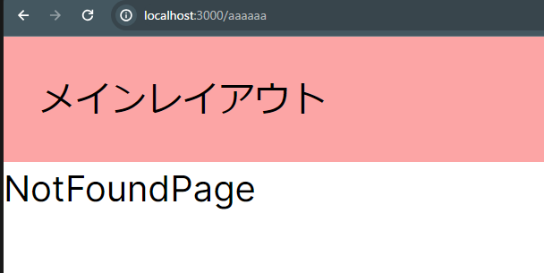
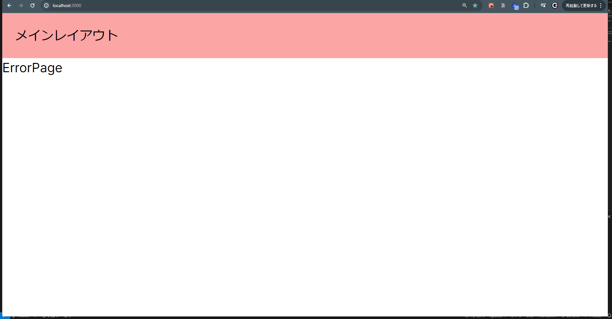
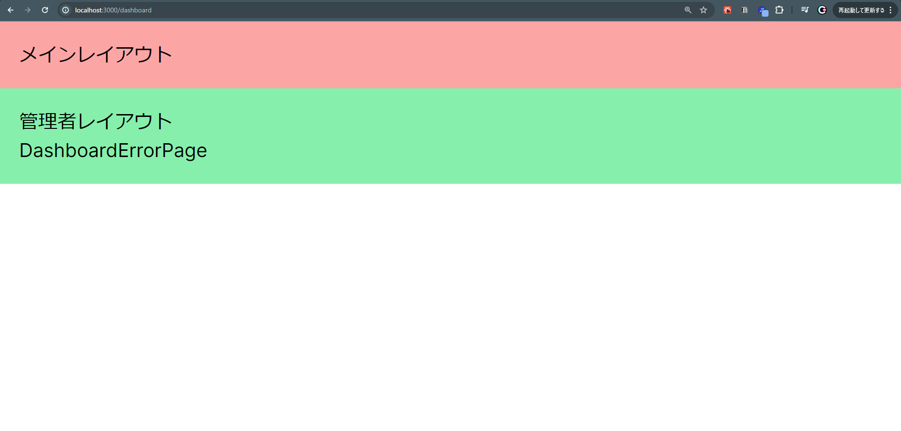

## エラーコンポーネント
- Nextjsにはアプリケーションの実行時にエラーが発生した場合、エラーコンポーネントを表示する機能が組み込まれている
## 存在しないページにアクセスした際に表示されるNotFoundコンポーネントと一般的なエラー発生時に表示されるエラーコンポーネントについて
- NotFoundコンポーネントとは
    存在しないパスにアクセスした際に表示される
    
    - デフォルト表示で問題ない場合、追加の設定は必要なし
    - NotFoundコンポーネントをカスタムしたい場合は、Found.tsxというファイル名でカスタムコンポーネントを作成する事が出来る
    - appディレクトリ配下にnot-found.tsxを作成
    ```  
    const NotFoundPage = () => {
      return (
        <div>NotFoundPage</div>
      )
    }
    export default NotFoundPage
    ```
    - localhost:3000/以降のパスで存在しないパスを入力すると下記のようにカスタムされたNotFoundPageが表示される
    - NotFoundPageにも共通レイアウトが適用される
    

- 一般的なエラーコンポーネントとは
    appディレクトリ配下にerror.tsxというファイルを作成することでappディレクトリ内でエラーが発生した場合に自動でエラーコンポーネントが表示される
    - NotFoundPageのようにページを作成するだけだとコンパイルエラーが発生する
    - 理由としては、error.tsxはclientコンポーネントである必要がある為、ファイルの先頭に"useclient"を追加しないといけない
    ```
    "use client"
    const ErrorPage = () => {
      return (
        <div>ErrorPage</div>
      )
    }
    export default ErrorPage
    ```
    - エラーを強制的に発生させる
    mainディレクトリ内のpage.tsxにthrow new Error()を記述し強制的にエラーを発生させる
    ```
    const page = () => {
      throw new Error()
      return (
        <div>hello next</div>
      )
    }
    export default page
    ```
    

    - さらにerror.tsxはネストが可能であり、複数のerror.tsxが存在する場合には、エラーが発生したコンポーネントに最も近いerror.tsxの内容が表示される
    - error.tsxをdashboardディレクトリ内にコピーし以下のように記述
    ```
    "use client"
    const DashboardErrorPage = () => {
      return (
        <div>DashboardErrorPage</div>
      )
    }
    export default DashboardErrorPage
    ```
    - dashboardディレクトリ内のpage.tsxにthrow new Error()を記述しアクセスする
    
    - DashboardErrorPageが表示され、appディレクトリ内のerror.tsxではなく、dashboardディレクトリ内のerror.tsxがレンダリングされる