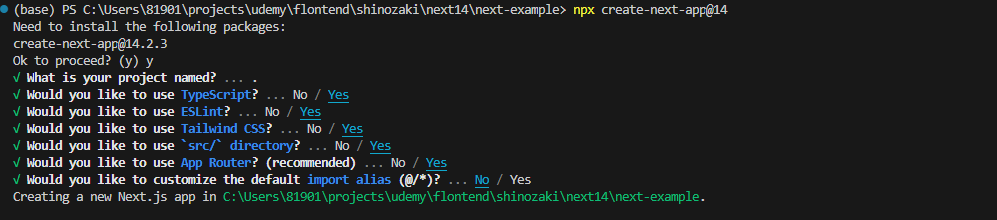
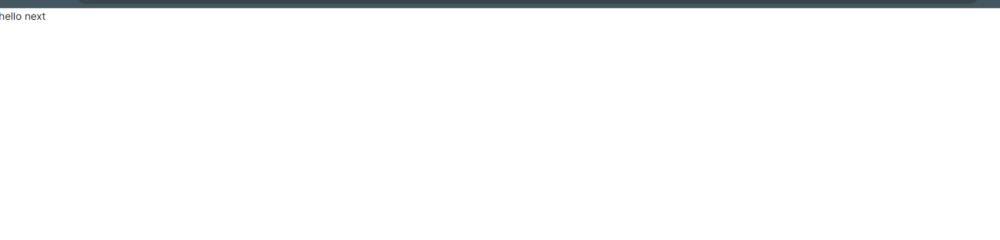

## インストール
 
- 1.インストール設定について
    srt/directoryの使用は任意だが、わかりやすさの為にyes
    import aliasはimportの表記を簡単にするもの
    今回は特にデフォルトから変更する必要がない為、No

- 2.インストールされた中身の説明
    node_modulesはインストールされたパッケージを格納するディレクトリ
    publicは画像やテキストなど静的ファイルを格納するディレクトリ
    srcはメインのソースコードを格納し、その中のappディレクトリはapprouterの中心となる重用なディレクトリ
    .eslintrc.jsonはESlintの設定が記述されている(今回はデフォルトのまま)
    .gitignoreはgit管理から除外するファイルやディレクトリを記述
    next-env.d.tsはTypeScriptでNext.jsの型を使用するためのファイル
    Nextjsでは基本的にデフォルトの設定で問題なく動作するが細かな設定を行いたい場合は、
    next.config.mjsに記述する
    package-lock.jsonとpakage.jsonはパッケージ情報を含むファイル
    pakage.jsonにはNextjsの起動コマンドやビルドコマンドも記述されている
    postcss.config.mjsとtailwind.config.tsはTailwindCSSの設定ファイル
    tsconfig.jsonはTypeScriptの設定ファイルで今回はデフォルトで使用

- 3.動作確認
    src/app/globals.cssファイルを下記のように不必要なものを削除する
    ```
    @tailwind base;
    @tailwind components;
    @tailwind utilities;
    ```
    page.tsxの中身をすべて削除しrafceで下記のように記述
    ```
    const page = () => {
      return (
        <div>hello next</div>
      )
    }
    export default page
    ```
    npm run devを実行

この状態になればセットアップ完了