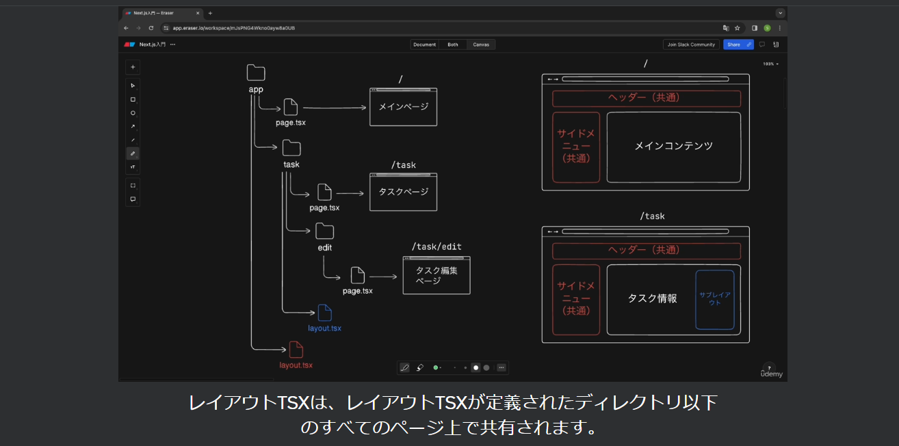
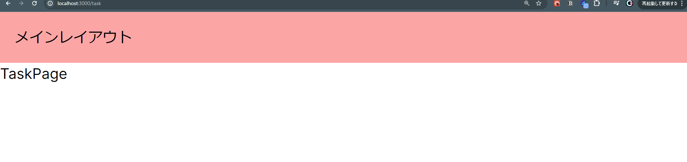
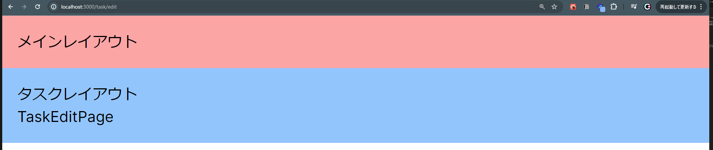

## 共通レイアウトとは
- webページを作成する際に、headerやsidemenuは多くのページで共通して使用される為、共通レイアウト機能を活用することが出来る
- 共通レイアウトではlayout.tsxという特別なファイル名を使用する
- layout.tsxが定義されたディレクトリ以下の全てのページ上で共有される

- 例えば、appディレクトリ配下にlayout.tsxファイルを配置しそこにheaderとsidemenuのレイアウトを定義するとappディレクトリ配下のメインページ、タスクページ、タスク編集ページの全ページに共通のレイアウトが適用される
- またlayout.tsxはネストすることも可能であり、taskディレクトリ内に別のlayout.tsxを配置した場合、appディレクトリ直下のメインページには赤色のレイアウトだけ適用となり、taskディレクトリ内のページにはappディレクトリ直下のレイアウトに加え、taskディレクトリのレイアウトも適用される

## layout.tsxを見てみる
```
import type { Metadata } from "next";
import { Inter } from "next/font/google";
import "./globals.css";

const inter = Inter({ subsets: ["latin"] });

export const metadata: Metadata = {
  title: "Create Next App",
  description: "Generated by create next app",
};

export default function RootLayout({
  children,
}: Readonly<{
  children: React.ReactNode;
}>) {
  return (
    <html lang="en">
      <body className={inter.className}>{children}</body>
    </html>
  );
}
```
- 共通レイアウトもReactコンポーネントとして定義され、レイアウトの定義だけでなくフォントやタイトルなどの共通情報の設定やデータのフェッチが行える
- コンポーネントの引数ではReactNode型のchildrenを受け取り、このchildrenには共通レイアウトを適用するpage.tsxのコンポーネントが渡される

## 共通レイアウトを実装しよう
appディレクトリ配下のlayout.tsxに下記を記述
```
      <body className={inter.className}>
        <div className="bg-red-300 p-4">メインレイアウト</div>
        {children}
        </body>
```

このようにヘッダーがlocalhost/3000/taskでも/editでも表示されるようになる

- 共通レイアウトのネストを確認
1.taskディレクトリ配下にlayout.tsxを作成
2.rafceでテンプレートを使用
3.コンポーネントのchildrenはappディレクトリのlayout.tsxからコピーして使用
下記の部分をコピーしてconst TaskLayout=()の()の中に貼りつける
```
{children,
  }: Readonly<{
    children: React.ReactNode;
  }>
```

```
const TaskLayout = ({
    children,
  }: Readonly<{
    children: React.ReactNode;
  }>) => {
  return (
    <div className="bg-blue-300 p-4">
        <div>タスクレイアウト</div>
        {children}
    </div>
  )
}

export default TaskLayout
```

