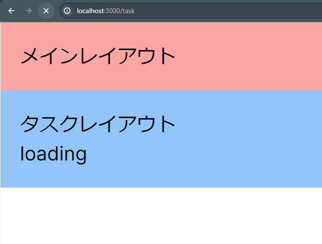

## LoadingComponentについて
- LoadingComponentは、データの取得など非同期処理を行っている間に表示されるコンポーネント
- routehandlerでリクエストを送信しデータを取得するサンプルを作成したが、今回はサンプルにLoadingComponentを追加する
- NextjsではLoadingComponentのファイル名をloading.tsxとする必要がある
- taskディレクトリ内にloading.tsxを作成
    ```
    const loading = () => {
      return (
        <div>loading</div>
      )
    }
    export default loading
    ```
    - これでタスクページにアクセスすると一瞬loadingの文字が表示される
    - 確認する為に、route.tsでsleep関数を定義しGET関数の中で呼び出し３秒間の待機を追加する
    ```
    const sleep = (ms:number):Promise<void> => new Promise((resolve) =>setTimeout(resolve,ms));
    export const GET = async () => {
        await sleep(3000);
        return NextResponse.json({tasks},{status:200})
    };
    ```
    - これでブラウザのをリロードすると下記の画面が明確に表示され3秒後にデータ取得処理が完了しタスクページに切り替わるようになっている
    