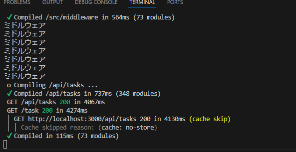

## ミドルウェアとは
- 通常ブラウザからNextjsの各ページにアクセスする場合、下記の図のようにそれぞれのページと直接やりとりを行っている

- ここにミドルウェアを導入することでブラウザからのリクエストがまずミドルウェアを経由し、その後実際のページに到達する

- これによりリクエストがページに到達する前に認証やロギング、リダイレクトなど様々な処理を挟み込むことが可能となる

## ミドルウェアを実装
- ミドルウェアを作成するには
    - 1.srcディレクトリ直下にmiddleware.tsを作成
        - このファイルはappディレクトリじゃなくsrcディレクトリ直下に配置する必要がある
    - 2.下記を記述
        - この関数では引数としてNextRequest型のrequestを受け取りリクエスト情報を利用できる
        - リクエストがミドルウェアを通過していることがわかるようにconsole.logでミドルウェアと記述
        - リクエストがミドルウェアを通過し、実際のページ処理に移行するには```return NextResponse.next();```を実行
        ```
        import { NextRequest, NextResponse } from "next/server";
        export const middleware = (request:NextRequest)=> {
        console.log("ミドルウェア");
        return NextResponse.next();
        }
        ```
        - ここでブラウザから任意のページにアクセスするとターミナルにミドルウェアと表示されており、リクエストがミドルウェアを経由していることが確認できる
        
        - デフォルトでは全てのリクエストがミドルウェアを経由するが、configオブジェクトを使って特定のページのみミドルウェアを適用することも可能
        - marcherプロパティにミドルウェアを適用したいページのパスを配列として指定する
        - 今回は、メインページの/とタスクページの/taskと設定すると、メインページとタスクページのみがミドルウェアを経由することになり、それ以外のページはミドルウェアを経由しない
        ```
        import { NextRequest, NextResponse } from "next/server";

        export const middleware = (request:NextRequest)=> {
            console.log("ミドルウェア");
            return NextResponse.next();
        }
        export const config = {
            marcher:["/","/task"]
        }
        ```
        - このようにミドルウェアを活用することで、アプリケーションのセキュリティ強化やリクエスト処理の柔軟性を高めることが出来る