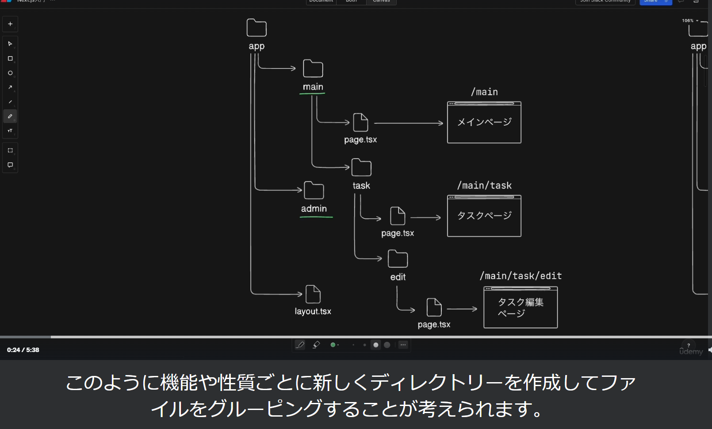
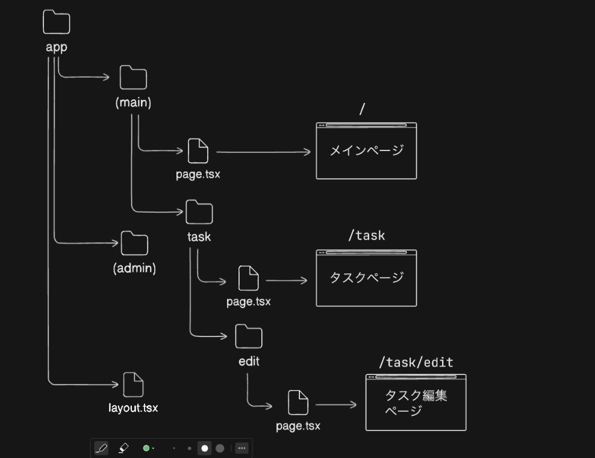
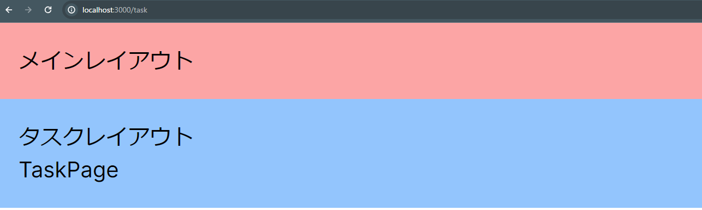

## ルートグループについて
- 開発を進めていくとappディレクトリ内のファイル数が増え管理が難しくなることがある
- 機能や性質ごとに新しくディレクトリを作成してファイルをグルーピングする


- appRouterのディレクトリはroutingのパスと紐づけられるので新しいディレクトリを作成するとディレクトリ名がURLのパスに追加され長いURLになることが懸念される
- 上記を解決するために、RootGroupを使用する


- RootGroupの使用はパスに反映させたくないディレクトリ名を()で閉じる
- 画像の流れだと、メインページには/、タスクページには/taskでアクセスできる
- RootGroupではグループごとに共通レイアウトを定義できる

## これまでに作成したファイルをメイングループにまとめる
- appディレクトリ内に(main)ディレクトリを作成しそこにtaskディレクトリを移動、さらにappディレクトリ内のpage.tsxを(main)ディレクトリに配置

- URLに(main)のパスが含まれていないことがわかる

## adminグループの作成
- appディレクトリ内に(admin)ディレクトリを作成
- dashboardディレクトリを作成しpage.tsxを配置しAdminDashboardPageを作成
- localhost:3000/dashboardでAdminDashboardPageにアクセスでき、(admin)のパスを含めずにアクセスできる
- adminグループに共通レイアウトを作成する為に、adminディレクトリ直下にtaskディレクトリのLayout.tsxをコピペ
- 中身を下記のように書き換える
```
const AdminLayout = ({
    children,
  }: Readonly<{
    children: React.ReactNode;
  }>) => {
  return (
    <div className="bg-green-300 p-4">
        <div>管理者レイアウト</div>
        {children}
    </div>
  )
}

export default AdminLayout
```
変更箇所は下記の※部分
```
const ※AdminLayout = ({
    children,
  }: Readonly<{
    children: React.ReactNode;
  }>) => {
  return (
    <div className=※"bg-green-300 p-4">
        <div>※管理者レイアウト</div>
        {children}
    </div>
  )
}

export default ※AdminLayout
```
- localhost:3000/dashboardには上記の管理者レイアウトが適用されるが、mainディレクトリ配下のレイアウトには反映されないようになっている
