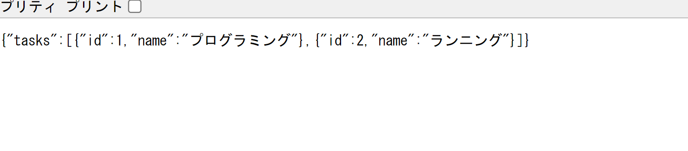

## ルートハンドラーについて
- バックエンドフレームワークで開発していたAPIをNextjs上で直接開発するための機能
    - appディレクトリのディレクトリ構造を利用してAPIエンドポイントのパスも定義できる

## 実装
- appディレクトリ直下にapi/tasks(apiディレクトリ直下にtasksディレクトリを作成)を作成する
    - このapiディレクトリはNextjsのルールとして定められてるわけではないが、ページとAPIのルートを区別しやすくするためにこの構造を推奨する
    - APIを作成するにはファイル名をroute.tsにする必要がある
    ```
    export const GET = async () => {}
    ```
    - 非同期関数を定義することで、ルートハンドラーとして機能するようになる
    - GETの関数名がhttpメソッドと対応しており、この例では/api/tasksエンドポイントへのGETリクエスト処理をすることになる
    - GETのほかにもPOST、PUT、DELETEなどのhttsメソッドにも対応している
    - httpメソッドが異なれば、一つのファイル内に複数のルートハンドラーを定義できる
    
    - データベースからデータを取得すると仮定してルートハンドラーを実装
    - route.ts内に2つのタスクを定義し、このタスクをルートハンドラーの戻り値としてクライアントに返却する
    ```
    export interface Task {
        id: number;
        name: string;
    }
    const tasks: Task[]=[
        {id:1,name:"プログラミング"},
        {id:2,name:"ランニング"},
    ];
    export const GET = async () => {}
    ```
    - JSONメソッドの第2引数にはステータスコードなどのオプションも設定できる
    - ルートハンドラーはデフォルトの設定では静的な要素としてビルドされる
    - つまりビルド時に取得するデータが決まってしまうので、例えばポートフォリオであったり、コーポレートサイトのように取得するデータがほとんど変わらないような場合には有効
    - SNSやタスク管理ツールなど、ユーザーの操作によってデータが頻繁に更新されるアプリケーションの場合、データが更新されず古いデータが表示されるという問題が発生する
    - データの更新頻度が高いアプリケーションでは、ダイナミックというオプションを追加してリクエスト毎に動的に実行されるように設定する必要があり、このオプションはルートセグメントCONFIGと呼ばれる
    ```
    import { NextResponse } from "next/server";
    export interface Task {
        id: number;
        name: string;
    };
    const tasks: Task[]=[
        {id:1,name:"プログラミング"},
        {id:2,name:"ランニング"},
    ];
    export const GET = async () => {
        return NextResponse.json({tasks},{status:200})
    };
    export const dynamic = "force-dynamic"
    ```
    - 上記でルートハンドラーが定義された為、ブラウザで/api/tasksにアクセスするとタスクデータが取得できていることが確認できる
    
    
## コンポーネントからルートハンドラーを呼び出し、データを取得する方法を確認
- taskディレクトリのpage.tsxからルートハンドラーにリクエストを送信する関数を定義する
    - ①アロー関数で非同期関数を作成
    - ②リクエストの送信にはfetch関数を使用
    - ③第一引数にはリクエスト先のURLを指定、第二引数にはオブジェクトでmethodにGETやPOSTといったhttpメソッドを指定
    - ④response.jsonでjson形式のレスポンスボディを返却する
    - ⑤Taskpageにasyncをつけて非同期関数にする
    - ⑥Task型の配列として、ルートハンドラーにリクエストを送信しタスクの配列を取得
    - ⑦取得したtaskリストをmap関数で表示する
    ```
    import { Task } from "@/app/api/tasks/route";
    ①const getTasks = async () =>{
      const response = await ②fetch③("http://localhost:3000/api/tasks",{method:"GET"});
      ④return await response.json();
    } 
    const ⑤TaskPage = async() => {
      const tasks = (await getTasks()).tasks as ⑥Task[];
      return (
        <div>
          <div>TaskPage</div>
          <div>⑦{tasks.map((task) =>(
            <div key={task.id}>{task.name}</div>
          ))}</div>
        </div>
      )
    }
    export default TaskPage
    ```
    
    - フェッチのキャッチ機能について
    - Nextjsのfecth関数はデフォルトでキャッシュを利用する設定になっている
    - この設定を確認するには、next.config.mjsにlogging:{}からを記述
    ```
    const nextConfig = {
        logging:{
            fetches:{
                fullUrl:true
            }
        }
    };
    export default nextConfig;
    ```
    - このオプションによりデータ取得時にキャッシュがヒットしたかをターミナルで確認できるようになる
    - ブラウザを更新するとターミナルに(cache:HIT)と表示されればAPIリクエストを送信せずにキャッシュのデータを利用していることがわかる
    
    - データの更新頻度が高く、キャッシュを利用したくない場合は、fetch関数の第二引数にcatch:"no-store"とするとキャッシュがスキップされて、キャッシュが無効になる
    
    - Nextjsではパフォーマンス向上の為に、可能な限りキャッシュを使用する設計がされているが、データの更新頻度が高いアプリケーションを構築するには少し注意が必要となる
