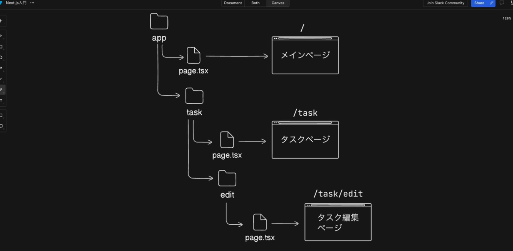
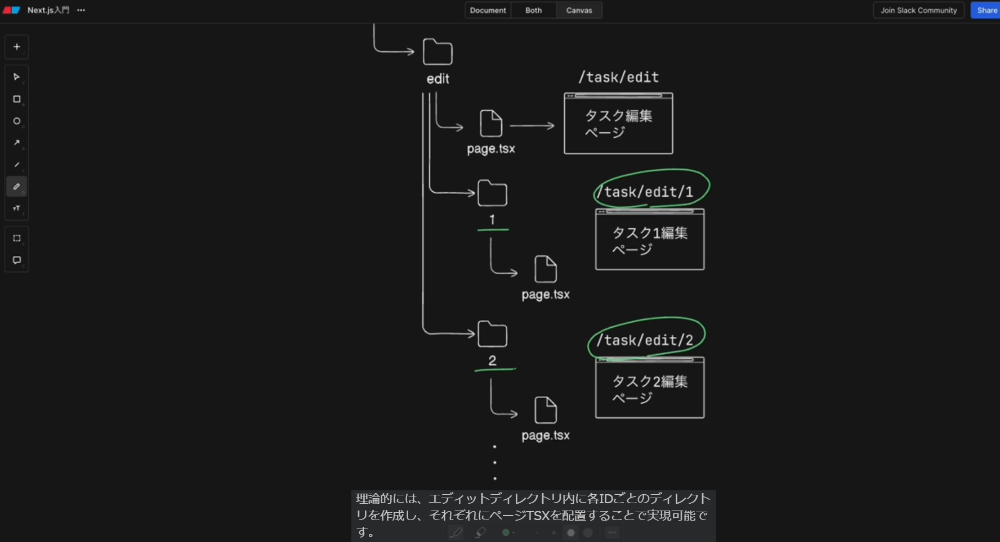
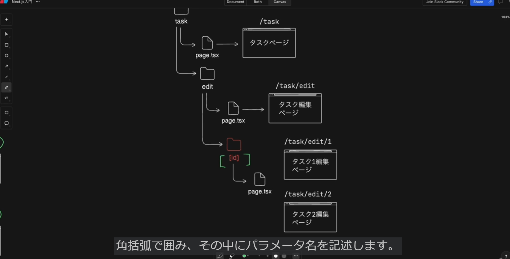
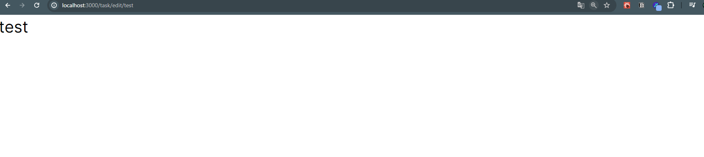

## ルーティングについて
　Reactの場合ルーティング機能がない為、外部ライブラリを利用してルーティングを実現する必要がある
　Next.jsでは標準機能としてルーティングがサポートされている
　Next.jsのルーティングは２種類あり、１つ目がこれまで利用されてきたpagesrouterと
　２つ目がバージョン13.4から安定版となったapprouterと呼ばれる新しいルーティング方式
　今後はapprouterが主流となる為、approuterを使用していく

- 1.approuterとは
　appディレクトリ配下のファイル構造に基づいてルーティングを決定する方法
　approuterが正常に動作する為にはルールがある

- 2.基本的なルーティング


- localhost:3000のアクセスは3000の後には/が省略されているものと考えた場合、/というパスへのアクセスは、ディレクトリ直下のpage.tsxの内容を表示している

- 同じように/taskというパスにアクセスしてタスクページを表示させたい場合は、taskディレクトリを作成しその中にpage.tsxを配置することで実現できる

- このようにapprouterではappディレクトリを基準として作成したディレクトリ名がパスに対応しており、各ディレクトリ内のpage.tsxがそのページに内容として表示される

- ディレクトリ名は利用したいパスの名前に合わせて任意で設定できるが、ページを表すファイル名は必ずpage.tsx　javascriptを使用している場合はpage.jsxである必要がある

- ディレクトリ構造はさらにネストさせることも可能で、taskの編集ページを作成したい場合、taskディレクトリの下にeditディレクトリを作成しその中にpage.tsxを配置すれば/task/editというパスでアクセスできる

## ルーティング実装
- 1.appディレクトリの下にtaskフォルダを作成しその中にpage.tsxを作成し下記を記述
    ```
    const TaskPage = () => {
      return (
        <div>TaskPage</div>
      )
    }
    export default TaskPage
    ```
    localhost:3000/taskで上記のページを表示できれば実装完了
    ※taskディレクトリ内のpage.tsxの名前をpage2.tsxやその他の名前にすると404foundエラーが発生しルーティングが機能しないようになっている
    ※page.tsxのページコンポーネントはexport defaultしないといけない

## ディレクトリのネスト構造を試す
- 1.taskディレクトリの中にeditディレクトリを作成しその中にpage.tsxを作成する
    ```
    const TaskEditPage = () => {
      return (
        <div>TaskEditPage</div>
      )
    }
    export default TaskEditPage
    ```
    localhost:3000/task/editで上記のページを表示できれば実装完了

## 動的ルーティングについて
- 動的ルーティングとはURLのパスに動的なパラメータを含めることが出来るルーティングのこと



- 各taskに編集ページが存在するとして、taskのIDが1の場合、URLのパスはlocalhost:3000/task/1となり、2の場合は2となる
- 理論的には、editディレクトリ内に各ID毎のディレクトリを作成し、それぞれにpage.tsxを配置することで実現可能だが、実際にはIDの数が100や1000となればこの方法は現実的ではない

- そこで利用されるのが動的ルーティングとなる


- 動的ルーティングでは[]でパラメータ(パラメータ名は任意だがこの例ではIDとする)を囲む

- [ID]ディレクトリの下にpage.tsxを配置すると/task/edit/[ID]となり任意の値がpage.tsxにマッピングされる

## 動的ルーティング実装
- editディレクトリの下に[id]ディレクトリを作成しその中にpage.tsxを配置
    ```
    const TaskIdEditPage = () => {
      return (
        <div>TaskIdEditPage</div>
      )
    }
    export default TaskIdEditPage
    ```
    - localhost:3000/task/edit/1(2やtestでも)にアクセスするとTaskIdEditPageが表示され、各IDディレクトリのpage.tsxが利用されていることがわかる
    - 指定したID部分のパスはコンポーネントでパラメータとして取得する事が出来る
    ```
    const TaskIdEditPage = ({params}:{
        params:{id:string}
    }) => {
      return (
        <div>TaskIdEditPage</div>
      )
    }
    export default TaskIdEditPage
    ```
    - コンポーネントの引数でparamsを指定しその型をparams:{id:string}とする
    - {id:string}のidはディレクトリ名と合わせる必要がある
    ```
    const TaskIdEditPage = ({params}:{
        params:{id:string}
    }) => {
      return (
        <div>{params.id}</div>
      )
    }
    export default TaskIdEditPage
    ```
    - {params.id}でパスのパラメータの値が画面に表示される
    下図はtestの場合
    
    
