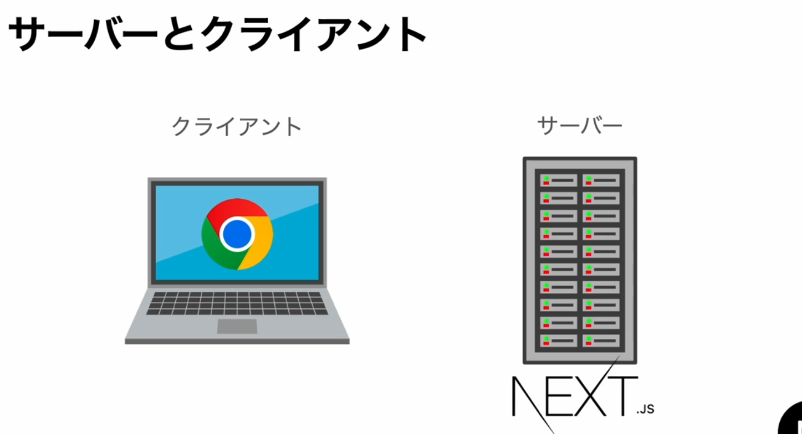
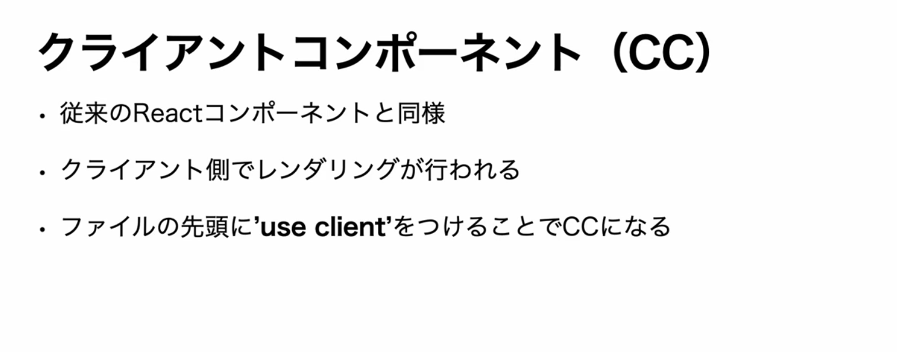
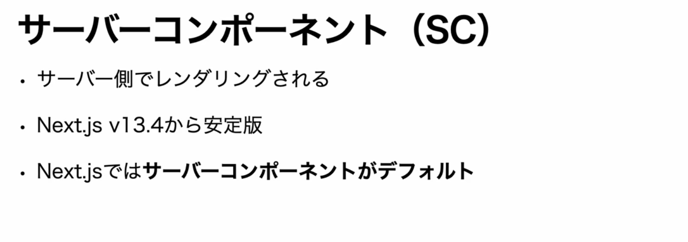
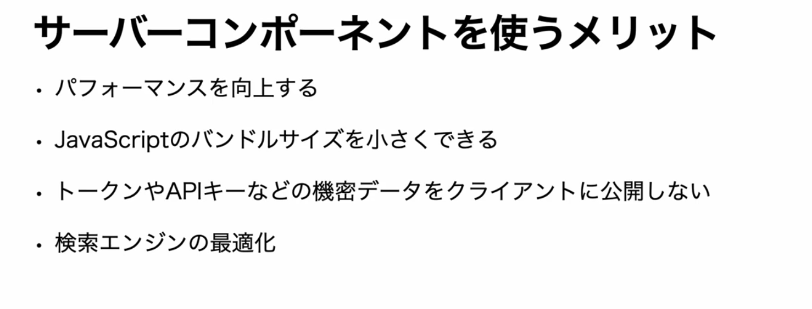
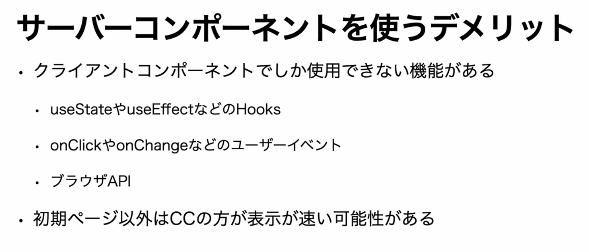
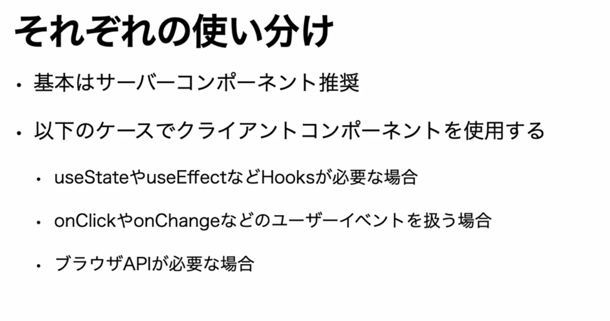
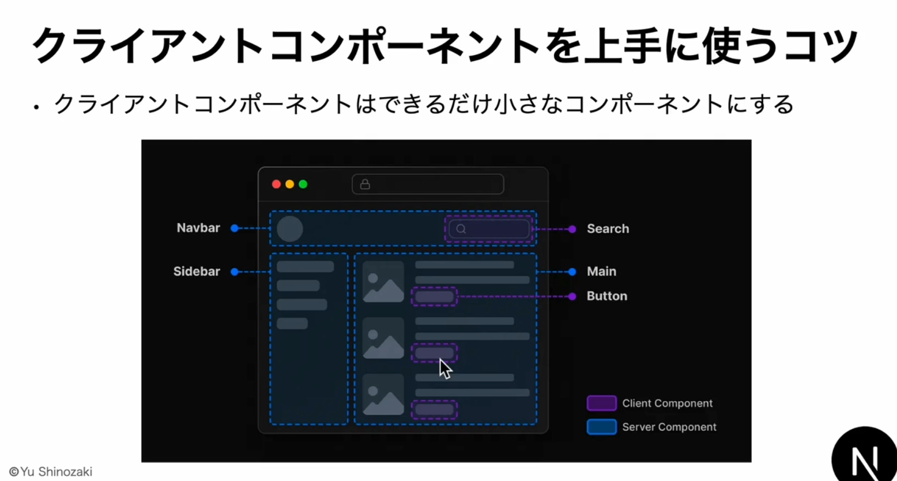
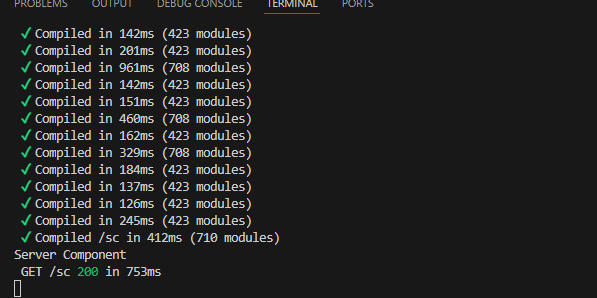
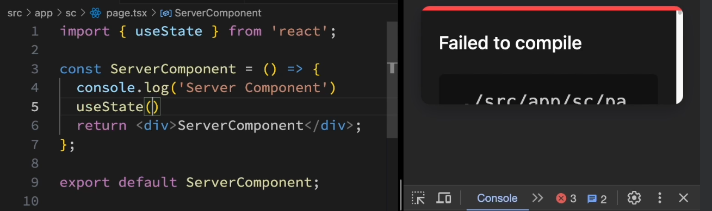
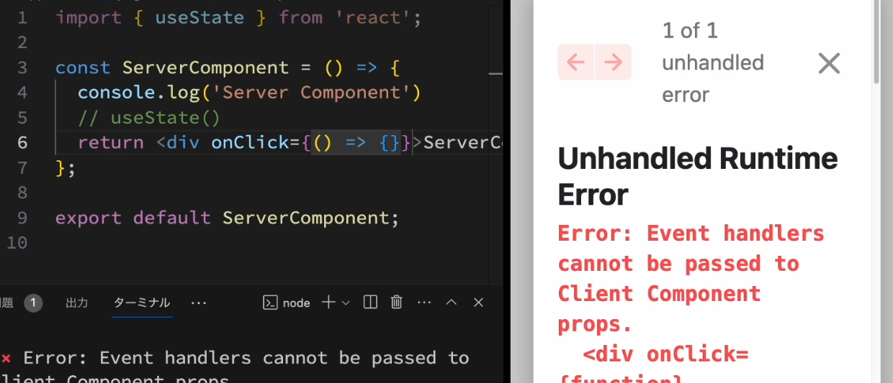

## サーバーとクライアント
- クライアントとはアプリケーションのユーザーがパソコンやスマホで開いているchromeやsafariといったブラウザ
- サーバーはNext.jsが起動しているコンピューター

- アプリケーションの開発中であれば、npm run devコマンドを実行しているパソコン、本番環境であればアプリケーションをデプロイしているコンピューター

- クライアントコンポーネントとは
    - 従来のReactコンポーネントと同様
    - ユーザーがブラウザでページにアクセスするとサーバーからjavascriptが送られ、ブラウザで実行することでレンダリングが行われる
    - Reactではクライアントコンポーネントが一般的だが、Nextjsではサーバーコンポーネントがデフォルトになっている
    - クライアントコンポーネントを利用するには、ファイルの先頭に"use client"を記述し明示的に指定する必要がある
    

- サーバーコンポーネントとは
    - サーバー側でレンダリングされるコンポーネント
    - Nextjs v13.4から安定版
    - Nextjsではサーバーコンポーネントがデフォルトとなり、基本的にはサーバーコンポーネントを利用することが推奨されている
    

- サーバーコンポーネントを使うメリット
    - サーバー側で重い処理を実行することが出来る為、パフォーマンスの向上が期待できる
    - 不要なjavascriptライブラリをクライアントに送る必要がなくなる為、バンドルサイズが小さくなり読み込み速度が向上される
    - トークンやAPIキーなど機密データを使用する処理をサーバー側で行うことでセキュリティ面も向上する
    - サーバー側でのレンダリング結果がクライアントに返される為、SEOにも効果的
    

- サーバーコンポーネントを使うデメリット
    - クライアントコンポーネントでしか使用できない機能がある
    - useStateやuseEffectなどのHooks、onClickやonChangeなどのユーザーがブラウザを操作するユーザーイベントやブラウザAPIも使用できない
    - 初回のリクエストではサーバーコンポーネントの方が表示速度が高速だが、それ以降のページ遷移ではクライアントにダウンロードしたjavascriptでページ遷移を行うクライアントコンポーネントの方が高速になる可能性がある
    

- それぞれの使い分け
    - 基本はサーバーコンポーネントをベースにし、必要に応じてクライアントコンポーネントを使用するというアプローチが最適
    - 特にHooksやユーザーイベントやブラウザAPIが必要な場合にクライアントコンポーネントを選択
    

- クライアントコンポーネントを上手に使うコツ
    - Nextjsでページを開発する際、ページ全体をサーバーコンポーネントかクライアントコンポーネントのどちらかにしなければならないといったことはない為、一つのページの中でHooksを使う必要があったり、ユーザーイベントを使う必要があったりする部分のみを小さなコンポーネントとして切り出し、クライアントコンポーネントとすることで大部分をサーバーコンポーネントとして残す事が出来る
    
    - 画像の中でクライアントコンポーネントにする必要があるのは、SearchとButtonだけ
    - こうすることでサーバーコンポーネントのメリットを得ながら必要な機能が実装できる

## vscodeでサーバーコンポーネントとクライアントコンポーネントの挙動について確認する
- appディレクトリ内にscディレクトリを作成し、その中にpage.tsxを作成する
- ccディレクトリも同様に作成

- サーバーコンポーネント(sc)を確認する
    - サーバーコンポーネントがサーバー側でレンダリングされているか確認するには、コンポーネント内でconsole.logを表示するのが最も簡単
    ```
    const ServerComponent = () => {
        console.log("Server Component")
        return (
        <div>ServerComponent
        </div>
      )
    }
    export default ServerComponent
    ```
    - 上記を記述し、localhost:3000/scにアクセスしF12で確認するとブラウザ側ではconsole.logは表示されず、vscodeのターミナル上で確認できる
    
    - console.logを出力するjavascriptではブラウザではなくNextjsが起動しているサーバーで実行されたということがわかる

- クライアントコンポーネント(cc)を確認する
    - クライアントコンポーネントもsc同様のことを行った場合は、ブラウザ上でconsole.logが確認できる
    - npm run devで開発サーバーを使用している場合は、ログが複数表示されたりターミナルにも表示されることがあるが、本番環境ではブラウザ上でしか表示されないようになる

- サーバーコンポーネントの制約
    - サーバーコンポーネントではuseState等のhooksを使用するとコンパイルエラーが発生する
    
    - またonClickなどのユーザーイベントもエラーが発生する
    
    

