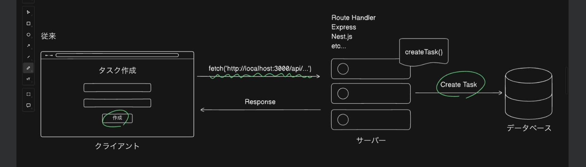
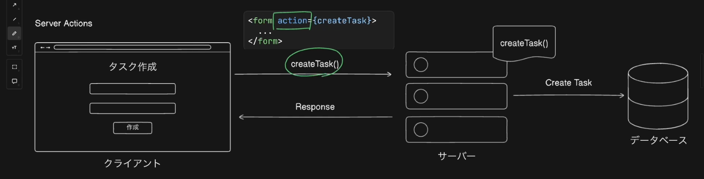
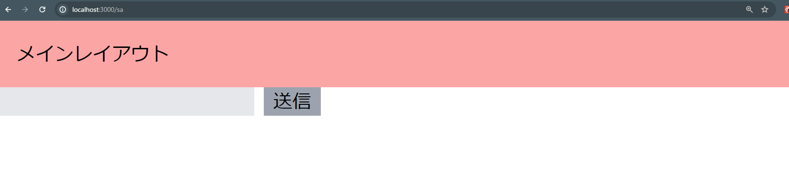
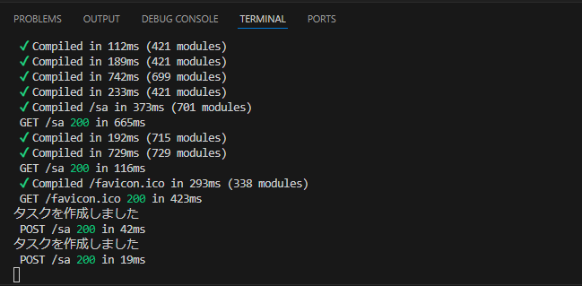
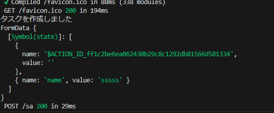
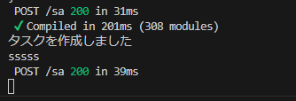
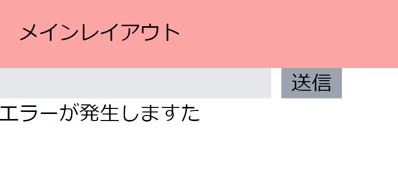

## serveractionsとは
- クライアントから直接呼び出すことができるサーバー側の非同期関数を指す
- 主なユースケースとしては、フォーム送信によるデータの変更処理となる


- 以前学習したroutehandlerやExpressやNestjsなどのバックエンドフレームを使用してデータ更新を行うにはAPIリクエストが必要となる
- クライアント側はフォームのボタンがクリックされると、onclickやonsubmitEventが発火し、クライアント側に記述されたAPI呼び出しのコードが実行される
- サーバー側はリクエストの内容に基づいて、Create Taskなど適切な処理を行う


- 上記をServerActionsを使用するとAPIを介さずにクライアントからサーバー側のcreateTask()を直接実行することが可能となる
- 具体的には、フォームタグのaction属性に関数名を指定することで関数を呼び出す
- ServerActionsを使用することで、不要なjavascriptのダウンロード量を削減し、結果としてパフォーマンスを向上させる事が出来る
- またクライアント側にAPIを呼び出す処理を記述する必要がなくなる為、コードがシンプルになり保守性が向上するメリットがある


## ServerActionsを定義し挙動を確認
- appディレクトリ内にsaディレクトリを作成しpage.tsxを作成し下記を記述
    ```
    const ServerActionsPage = () => {
      return (
        <div>
            <form>
                <input type="text" id="name" name="name" className="bg-gray-200" />
                <button type="submit" className="bg-gray-400 ml-2 px-2">送信</button>
            </form>
        </div>
      )
    }
    export default ServerActionsPage
    ```
    - localhost:3000/saにアクセスすると下記の画面になる
    

- ServerActionsを定義する
    - ServerActionsはサーバーコンポーネントであれば同一ファイル内に直接記述することも可能だが可読性向上の為に別ファイルに分けることを推奨されている
    - ServerActionsはサーバーコンポーネントとクライアントコンポーネントどちらでも利用できるがクライアントコンポーネントの場合は同一ファイル内に記述することはできず、別ファイルに定義されたServerActionsのみ利用可能という制約がある
    - 別ファイルに定義しておくことで、サーバーコンポーネントとクライアントコンポーネントのどちらからでも利用できるようにする方が良い
    - ServerActionsではディレクトリ名やファイル名に特別なルールはないため、任意の名前を付けることが可能
    - ServerActionsを定義するファイルの先頭には"use server"というディレクティブを追加する必要があり、そのファイルに定義された非同期関数がServerActionsとして認識されるようになる
    
    - srcディレクトリ内にactionsフォルダを作成しsampleActions.tsを作成
    - 下記を記述しログを出力するようにしておく
    ```
    "use server";
    export const createTask = async () =>{
        // DBにタスクを作成
        console.log("タスクを作成しました");
    };
    ```
    - 上記のcreateTask関数をsaのpage.tsx内のformのaction属性に渡すことでformからcreateTask関数が実行可能となる
    ```
    import { createTask } from "@/actions/sampleActions"
    const ServerActionsPage = () => {
      return (
        <div>
            <form action={createTask}>
                <input type="text" id="name" name="name" className="bg-gray-200" />
                <button type="submit" className="bg-gray-400 ml-2 px-2">送信</button>
            </form>
        </div>
      )
    }
    export default ServerActionsPage
    ```
    - ブラウザをリロードしフォームに文字を入力後、送信ボタンを押す
    - ブラウザには何も出力されず、下記の画像のようにターミナル側で出力され、createTask関数がサーバー側で実行されたことがわかる
    
    - またServerActionsでformの値を受け取るには非同期関数の引数にformData型のFormDataを取る
    ```
    "use server";
    export const createTask = async (formData:FormData) =>{
        // DBにタスクを作成
        console.log("タスクを作成しました");
        console.log(formData);
        };
    ```
    - このformDataを上記のようにログとして出すと下記の画像のようにformDataはオブジェクト形式になっていることがわかる
    
    - このオブジェクトから具体的な値を取り出すには、formDataのgetメソッドにinputタグのname属性で指定したキーを渡す
    - 今回はname属性に"name"を渡している為、getメソッドにも"name"を渡す
    ```
    "use server";
    export const createTask = async (formData:FormData) =>{
        // DBにタスクを作成
        console.log("タスクを作成しました");
        console.log(formData.get("name"));
    };
    ```
    - この状態でブラウザで文字を入力すると、input要素の値が取得できていることが確認できる
    
    - さらにjavascriptのバインドメソッドを用いることでformに存在しないデータもServerActionsに渡す事が出来る
    - 例えば、saディレクトリのpage.tsxでtaskIdを定義
    ```
    import { createTask } from "@/actions/sampleActions"
    const ServerActionsPage = () => {
        const taskId = 1;
      return (
        <div>
            <form action={createTask}>
                <input type="text" id="name" name="name" className="bg-gray-200" />
                <button type="submit" className="bg-gray-400 ml-2 px-2">送信</button>
            </form>
        </div>
      )
    }
    export default ServerActionsPage
    ```
    - この値をServerActionsで使用したい場合、createTask関数の第一引数でtaskId:numberとしてこの変数をログ出力できるようにする
    ```
    "use server";
    export const createTask = async (taskId:number,formData:FormData) =>{
        // DBにタスクを作成
        console.log("タスクを作成しました");
        console.log(formData.get("name"));
        console.log(taskId);
    };
    ```
    - さらにpage.tsxではcreateTask.bind()で第一引数にはnull第二引数には使用したい変数を渡す
    - これでtaskIdを引数に含む新しい関数を作成出来る
    - その関数をconst createTaskWithTaskIdで受け取りcreateTask関数の代わりにformのaction属性に渡すことでtaskIdをServerActionsに渡す事が出来る
    ```
    import { createTask } from "@/actions/sampleActions"
    const ServerActionsPage = () => {
        const taskId = 1;
        const createTaskWithTaskId = createTask.bind(null,taskId)
      return (
        <div>
            <form action={createTaskWithTaskId}>
                <input type="text" id="name" name="name" className="bg-gray-200" />
                <button type="submit" className="bg-gray-400 ml-2 px-2">送信</button>
            </form>
        </div>
      )
    }
    export default ServerActionsPage
    ```
    - ブラウザからServerActionを実行すると下記の画像のようにターミナルにtaskIdとして1が表示されており、bindメソッドを使用してformに存在しない変数も渡せていることが確認できる

## ServerActionsと合わせて利用される便利なHooks
- 1.useFormState
    - useFormStateは、サーバーが返す値をクライアント側でstateとして扱うことが出来るHooksになる
    - サーバー側で発生したエラーをクライアントに表示するようなケースで利用される
    - Hooksはサーバーコンポーネントでは使用できない為、saのpage.tsxに"use client"と追加してクライアントコンポーネントとする

    - 実装
    - saのpage.tsxを下記のように記述
    - 1.useFormStateをreact-domからimport
    - 2.useFormState()の第一引数にServerActionsであるcreateTaskWithTaskIdを渡す
    - 3.今回は前回のレクチャーの続きの為、createTaskWithTaskIdを渡しているが特にtaskIdなどの値を追加する必要がない場合は、直接createTaskを渡して構わない
    - 4.第二引数にはstateの初期状態を設定する
    - 5.今回は、```const initialState ={error:""}```として初期状態を定義し第二引数に渡す
    - 6.このHooksの戻り値は```const [state,formAction]```で受け取る
    - 7.１番目のStateはServerActionsの戻り値で2番目のformActionはServerActionsと同じ動きをする関数
    - 8.createTaskでstateを返却していない為、エラーが発生するのでsampleActions.tsでintarface FormStateを定義しcreateTask関数の引数でformData:FormDataの前にstate:FormStateを追加
    - 9.ServerActionの中でエラーが発生したという仮定でstate.error="エラーが発生しました"
    - 10.return Stateでstateを返却する
    - 11.saのpage.tsxに戻りformタグのaction属性にuseFormStateの戻り値であるformActionを渡す
    - 12.これによりServerActionsの戻り値をクライアント側で利用できるようになった為、buttonタグの後に、{state.error}を追加
    ```
    sa/page.tsx

    "use client";

    import { useFormState } from "react-dom";

    import { createTask } from "@/actions/sampleActions"

    const ServerActionsPage = () => {
        const taskId = 1;
        const createTaskWithTaskId = createTask.bind(null,taskId)
        const initialState = {error:""}
        const [state,formAction] = useFormState(createTaskWithTaskId,initialState)
      return (
        <div>
            <form action={formAction}>
                <input type="text" id="name" name="name" className="bg-gray-200" />
                <button type="submit" className="bg-gray-400 ml-2 px-2">送信</button>
                <div>{state.error}</div>
            </form>
        </div>
      )
    }

    export default ServerActionsPage
    ```

    ```
    sampleActions.ts

    "use server";

    interface FormState{
        error:string;
    }

    export const createTask = async (taskId:number,state:FormState,formData:FormData) =>{
        // DBにタスクを作成
        console.log("タスクを作成しました");
        console.log(formData.get("name"));
        console.log(taskId);
        state.error = "エラーが発生しますた"
        return state;
    };
    ```

    - 13.ブラウザの送信ボタンを押すとエラーが発生しましたと表示され、ServerActionsの戻り値を利用出来ている事が確認できる
    

- 2.useFormStatusHookについて
    - このHooksはServerActionsの状態を取得する為に使用する
    - useFormStatusを利用する際の注意点は、Formが定義されたコンポーネントの直下で使用しても期待通りに動作しないこと
    - その為、下記のようにコンポーネントを１段階ラップする必要がある
    ```
    const SubmitButton=()=>{
        const {pending} = useFormStatus();
    }
    ```
    - このpendingはServerActionsが実行中の場合にtrueになる為、フォーム送信中に送信ボタンを非活性にするといった使い方が可能になる
    - 最後に<SubmitButton/>を追加し送信ボタンをクリックすると一瞬薄いグレーになりServerActions時の実行中にボタンを非活性にできていることが確認できる
    ```
    "use client";

    import { useFormState,useFormStatus } from "react-dom";

    import { createTask } from "@/actions/sampleActions"

    const ServerActionsPage = () => {
        const taskId = 1;
        const createTaskWithTaskId = createTask.bind(null,taskId)
        const initialState = {error:""}
        const [state,formAction] = useFormState(createTaskWithTaskId,initialState)

        const SubmitButton = () => {
            const {pending} = useFormStatus();
            return(
                <button type="submit" className="bg-gray-400 ml-2 px-2 disabled:bg-gray-300" 
                disabled={pending} 
                >
                    送信
                </button>
            )
        }
    return (
        <div>
            <form action={formAction}>
                <input type="text" id="name" name="name" className="bg-gray-200" />
                <SubmitButton/>
                <div>{state.error}</div>
            </form>
        </div>
      )
    }

    export default ServerActionsPage
    ```


    


